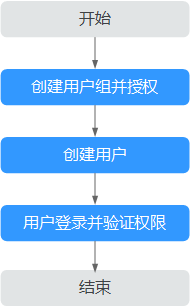
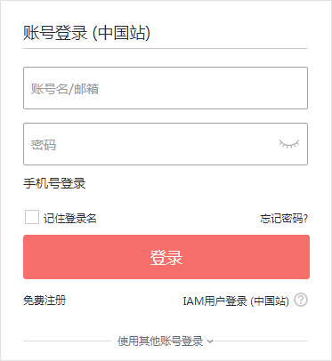
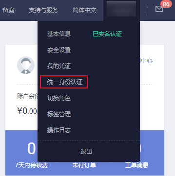
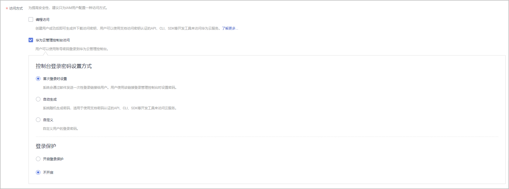

# 创建用户并授权使用VOD

本章节通过简单的用户组授权方法，将VOD服务的策略授予用户组，并将用户添加至用户组中，从而使用户拥有对应的VOD权限，操作流程如[图1](#fig1354612376295)所示。

## 示例流程

**图 1**  给用户授权VOD只读权限流程  

1.  创建用户组并授权

    在IAM控制台创建用户组，并授予视频点播服务只读权限“VOD Guest”。

2.  创建用户

    在IAM控制台创建用户，并将其加入[1.创建用户组并授权](#li199281721153012)中创建的用户组。

3.  用户登录并验证权限

    新创建的用户登录控制台，验证视频点播服务的只读权限。

## 前提条件

给用户组授权之前，请您了解用户组可以添加的VOD系统策略，并结合实际需求进行选择，VOD支持的系统策略及策略间的对比，请参见：[VOD系统策略](https://support.huaweicloud.com/productdesc-vod/vod030006.html)。若您需要对除VOD之外的其它服务授权，IAM支持服务的所有策略请参见[权限策略](https://support.huaweicloud.com/usermanual-permissions/zh-cn_topic_0063498930.html)。

## 步骤1：创建用户组并授权

用户组是用户的集合，IAM通过用户组功能实现用户的授权。您在IAM中创建的用户，需要加入特定用户组后，用户才具备用户组所拥有的权限。关于创建用户组并给用户组授权的方法，可以参考如下操作。

1.  使用注册的华为云账号登录华为云，登录时请选择“账号登录”。

    **图 2**  账户登录（中国站）  
    

2.  进入华为云控制台， 控制台页面中单击右上角的用户名，选择“统一身份认证”。

    **图 3**  统一身份认证  
    

3.  在统一身份认证服务的左侧导航空格中，单击“用户组 \> 创建用户组“。

    **图 4**  创建用户组  
    

4.  在“创建用户组”界面，输入“用户组名称”，以“点播只读组”为例，单击“确定”。

    用户组创建完成，界面自动返回用户组列表，列表中显示新建的用户组。

5.  单击新建用户组右侧的“权限配置”，在“用户组权限”页签中，基于需要授权的区域，单击“设置策略”。

    VOD为项目级服务，请确认用户需要使用VOD资源的项目，然后在对应项目中设置权限，则用户仅能访问授权项目中的VOD资源，无法访问其他项目中的VOD资源。

## 步骤2：创建IAM用户

IAM用户与企业中的实际员工或是应用程序相对应，有唯一的安全凭证，可以通过加入一个或多个用户组来获得用户组的权限。关于IAM用户的创建方式请参见如下步骤。

1.  在统一身份认证服务，左侧导航中，单击“用户 \> 创建用户“。
2.  在“创建用户”页面填写“用户信息”。如需一次创建多个用户，可以单击“添加用户”进行批量创建，每次最多可创建10个用户。

    **图 5**  添加用户  
    

    -   用户名：用户登录华为云的用户名，以“James”为例。
    -   邮箱：IAM用户绑定的邮箱，仅“访问方式”选择“首次登录时设置”时必填，选择其他访问方式时选填。
    -   手机号（选填）：IAM用户绑定的手机号。
    -   描述（选填）：对用户的描述信息。

3.  在“创建用户”页面选择“访问方式”，完成后单击“下一步”。

    **图 6**  选择访问方式  
    

    -   编程访问：创建用户完成后即可下载本次创建的所有用户的[访问密钥](https://support.huaweicloud.com/usermanual-ca/zh-cn_topic_0046606340.html)。
    -   华为云管理控制台访问：用户可以使用账号密码登录到华为云管理控制台。
        1.  控制台登录密码设置方式：当一次创建多个用户时，密码设置方式可选择“首次登录时设置”和“自定义”，不支持“自动生成”密码；当仅创建一个用户时，以上方式均可选择。
        2.  登录保护：为了您的账号安全，建议选择“开启登录保护”。后续如需开启或关闭登录保护，请参见：[登录保护](https://support.huaweicloud.com/usermanual-iam/zh-cn_topic_0079477316.html)。

4.  （可选）将用户加入到用户组，完成后单击“下一步”。
    -   选择新创建的用户组“点播只读组”。将用户加入用户组，用户将具备用户组的权限，这一过程即给该用户授权。其中“admin”为系统缺省提供的用户组，具有管理人员以及所有云服务资源的操作权限。
    -   如需创建新的用户组，可单击“创建用户组”，填写用户组名称和描述（可选），创建成功后即可将用户加入到新创建的用户组中。

5.  IAM用户创建成功，用户列表中显示新创建的IAM用户。如果在访问方式中勾选了“编程访问”，可在此页面下载访问密钥，后续也可以在“我的凭证”中[管理访问密钥](https://support.huaweicloud.com/usermanual-ca/zh-cn_topic_0046606340.html)。

    **图 7**  下载访问密钥  
    

## 步骤3：用户登录并验证权限

用户创建完成后，可以使用新用户的用户名及身份凭证登录华为云验证权限，即“VOD Guest”权限。更多用户登录方法请参见[用户登录华为云方法](https://support.huaweicloud.com/qs-iam/iam_01_0031.html#section2)。

1.  在华为云登录页面，单击右下角的“IAM用户登录”。
2.  在“IAM用户登录”页面，输入账号名、用户名及用户密码，使用新创建的用户登录。

    -   账号名为该IAM用户所属华为云账号的名称。
    -   用户名和密码为账号在IAM创建用户时输入的用户名和密码。

    如果登录失败，您可以联系您的账号主体，确认用户名及密码是否正确，或是重置用户名及密码，重置方法请参见：[忘记IAM用户密码](https://support.huaweicloud.com/iam_faq/iam_01_0314.html#section1)。

3.  登录成功后，进入华为云控制台，在左上角切换至授权区域，如“华北-北京四”。
4.  在“服务列表”中选择视频点播服务，进入VOD“音视频审核”界面，若提示权限不足，表示“VOD Guest”已生效。
5.  在“服务列表”中选择除弹性云服务器外的任一服务，若提示权限不足，表示“VOD Guest”已生效。

## 创建媒资隔离的用户

视频点播提供了VOD Administrator、VOD Operator、VOD Guest、VOD Group Administrator、VOD Group Operator、VOD Group Guest六个系统策略，具体请参考[产品介绍-权限管理](https://support.huaweicloud.com/productdesc-vod/vod030006.html)。其中前三个系统策略仅能进行操作权限的划分，若您还需要对视频点播中存储的媒资进行隔离，建议您使用后三个系统策略，它们既支持操作权限划分，也支持媒资隔离。媒资隔离是指仅同组内的用户能访问或管理该组其他用户创建的媒资。

媒资隔离示例如[表1](#table1128611499308)所示。

**表 1**  账号权限配置建议

<table><thead align="left"><tr id="row928818497301"><th class="cellrowborder" valign="top" width="25%" id="mcps1.2.5.1.1">
策略组

</th>
<th class="cellrowborder" valign="top" width="25%" id="mcps1.2.5.1.2">
用户A（管理账号）

</th>
<th class="cellrowborder" valign="top" width="25%" id="mcps1.2.5.1.3">
用户B（上传账号）

</th>
<th class="cellrowborder" valign="top" width="25%" id="mcps1.2.5.1.4">
用户C（观看账号）

</th>
</tr>
</thead>
<tbody><tr id="row528854923017"><td class="cellrowborder" valign="top" width="25%" headers="mcps1.2.5.1.1 ">
VOD Group Administrator

</td>
<td class="cellrowborder" valign="top" width="25%" headers="mcps1.2.5.1.2 ">
√

</td>
<td class="cellrowborder" valign="top" width="25%" headers="mcps1.2.5.1.3 ">
-

</td>
<td class="cellrowborder" valign="top" width="25%" headers="mcps1.2.5.1.4 ">
-

</td>
</tr>
<tr id="row3289124953019"><td class="cellrowborder" valign="top" width="25%" headers="mcps1.2.5.1.1 ">
VOD Group Operator

</td>
<td class="cellrowborder" valign="top" width="25%" headers="mcps1.2.5.1.2 ">
-

</td>
<td class="cellrowborder" valign="top" width="25%" headers="mcps1.2.5.1.3 ">
√

</td>
<td class="cellrowborder" valign="top" width="25%" headers="mcps1.2.5.1.4 ">
-

</td>
</tr>
<tr id="row52891249103013"><td class="cellrowborder" valign="top" width="25%" headers="mcps1.2.5.1.1 ">
VOD Group Guest

</td>
<td class="cellrowborder" valign="top" width="25%" headers="mcps1.2.5.1.2 ">
-

</td>
<td class="cellrowborder" valign="top" width="25%" headers="mcps1.2.5.1.3 ">
-

</td>
<td class="cellrowborder" valign="top" width="25%" headers="mcps1.2.5.1.4 ">
√

</td>
</tr>
</tbody>
</table>

以上三种策略组，不管是低权限的账户还是高权限的账户，都只能操作本组内用户创建的媒资，达到了媒资隔离的效果，即用户A、B、C只能访问自己组内的媒资。

若用户A需要能操作用户B创建的媒资，则用户A需要加入B所在的VOD Group Operator策略组。

