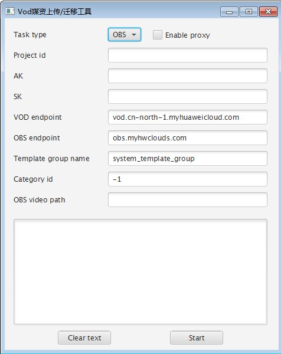

# 工具批量上传<a name="zh-cn_topic_0128969695"></a>

若您的音视频文件存储在华为云OBS桶或本地中，您也可以下载安装批量上传工具，将音视频文件迁移到视频点播中。提供了Windows和Linux两版批量上传工具，您可以根据需要进行下载安装。

## 使用限制<a name="section176241714124912"></a>

-   目前**不支持**跨区域进行OBS音视频迁移，如“华南-广州”OBS桶中的资源**不能**转存在点播服务所在的“华北-北京四”桶中。
-   Oracle JDK已安装且版本不低于JDK1.8版本（暂不支持Open JDK）。
-   目前仅支持上传MP4、TS、MOV、MXF、MPG格式的视频文件。

## 前提条件<a name="section16306111462"></a>

-   已安装OracleJDK1.8及以上版本，并完成环境配置，具体操作请参见[安装JDK](安装JDK.md)。
-   已下载批量上传工具，[下载地址](https://bbs.huaweicloud.com/forum/thread-11537-1-1.html)。

## Windows系统批量上传<a name="section168431013910"></a>

1.  安装批量上传工具。

    解压安装包“VodProcessTool-windows.zip“，并对获取的“VodProcessTool-1.0-SNAPSHOT-windows.zip“包进行再解压，即可得到主程序“VodProcessTool.jar“。

2.  双击“VodProcessTool.jar“，启动工具。
3.  配置上传任务，参数说明如[表1](#zh-cn_topic_0125622906_table06871819181710)所示。

    **图 1**  配置上传任务<a name="fig3425165811142"></a>  
    

    **表 1**  配置项说明

    <a name="zh-cn_topic_0125622906_table06871819181710"></a>
    <table><thead align="left"><tr id="zh-cn_topic_0125622906_row19688131971715"><th class="cellrowborder" valign="top" width="20.43%" id="mcps1.2.3.1.1"><p id="zh-cn_topic_0125622906_p4389021163216"><a name="zh-cn_topic_0125622906_p4389021163216"></a><a name="zh-cn_topic_0125622906_p4389021163216"></a><strong id="zh-cn_topic_0125622906_b161870541721"><a name="zh-cn_topic_0125622906_b161870541721"></a><a name="zh-cn_topic_0125622906_b161870541721"></a>配置项</strong></p>
    </th>
    <th class="cellrowborder" valign="top" width="79.57%" id="mcps1.2.3.1.2"><p id="zh-cn_topic_0125622906_p338911218325"><a name="zh-cn_topic_0125622906_p338911218325"></a><a name="zh-cn_topic_0125622906_p338911218325"></a><strong id="zh-cn_topic_0125622906_b101883541024"><a name="zh-cn_topic_0125622906_b101883541024"></a><a name="zh-cn_topic_0125622906_b101883541024"></a>说明</strong></p>
    </th>
    </tr>
    </thead>
    <tbody><tr id="zh-cn_topic_0125622906_row9688171981713"><td class="cellrowborder" valign="top" width="20.43%" headers="mcps1.2.3.1.1 "><p id="zh-cn_topic_0125622906_p8390122133218"><a name="zh-cn_topic_0125622906_p8390122133218"></a><a name="zh-cn_topic_0125622906_p8390122133218"></a>Task type</p>
    </td>
    <td class="cellrowborder" valign="top" width="79.57%" headers="mcps1.2.3.1.2 "><p id="zh-cn_topic_0125622906_p15390621133211"><a name="zh-cn_topic_0125622906_p15390621133211"></a><a name="zh-cn_topic_0125622906_p15390621133211"></a>任务类型。</p>
    <a name="ul11386658123015"></a><a name="ul11386658123015"></a><ul id="ul11386658123015"><li>ECS：表示本地上传文件到VOD。</li><li>OBS：代表从OBS桶中迁移媒资到VOD。</li></ul>
    </td>
    </tr>
    <tr id="zh-cn_topic_0125622906_row154316115418"><td class="cellrowborder" valign="top" width="20.43%" headers="mcps1.2.3.1.1 "><p id="zh-cn_topic_0125622906_p15442120418"><a name="zh-cn_topic_0125622906_p15442120418"></a><a name="zh-cn_topic_0125622906_p15442120418"></a>Enable proxy</p>
    </td>
    <td class="cellrowborder" valign="top" width="79.57%" headers="mcps1.2.3.1.2 "><p id="zh-cn_topic_0125622906_p1854491174111"><a name="zh-cn_topic_0125622906_p1854491174111"></a><a name="zh-cn_topic_0125622906_p1854491174111"></a>代理服务器，请根据实际需求进行配置，确保安装该工具的PC能与视频点播和OBS进行正常通信。</p>
    </td>
    </tr>
    <tr id="zh-cn_topic_0125622906_row16688151912179"><td class="cellrowborder" valign="top" width="20.43%" headers="mcps1.2.3.1.1 "><p id="zh-cn_topic_0125622906_p13901921193219"><a name="zh-cn_topic_0125622906_p13901921193219"></a><a name="zh-cn_topic_0125622906_p13901921193219"></a>Project id</p>
    </td>
    <td class="cellrowborder" valign="top" width="79.57%" headers="mcps1.2.3.1.2 "><p id="zh-cn_topic_0125622906_p20390192113323"><a name="zh-cn_topic_0125622906_p20390192113323"></a><a name="zh-cn_topic_0125622906_p20390192113323"></a>华为云账号对应的项目ID，获取方法请参考<a href="获取项目ID.md">获取Project ID</a>。</p>
    </td>
    </tr>
    <tr id="zh-cn_topic_0125622906_row1689131919175"><td class="cellrowborder" valign="top" width="20.43%" headers="mcps1.2.3.1.1 "><p id="zh-cn_topic_0125622906_p5390172114321"><a name="zh-cn_topic_0125622906_p5390172114321"></a><a name="zh-cn_topic_0125622906_p5390172114321"></a>AK</p>
    </td>
    <td class="cellrowborder" valign="top" width="79.57%" headers="mcps1.2.3.1.2 "><p id="zh-cn_topic_0125622906_p739072113217"><a name="zh-cn_topic_0125622906_p739072113217"></a><a name="zh-cn_topic_0125622906_p739072113217"></a>华为云账号对应的访问密钥ID，获取方法请参考<a href="获取AK和SK.md">获取AK和SK</a>。</p>
    </td>
    </tr>
    <tr id="zh-cn_topic_0125622906_row768981914178"><td class="cellrowborder" valign="top" width="20.43%" headers="mcps1.2.3.1.1 "><p id="zh-cn_topic_0125622906_p14390821143213"><a name="zh-cn_topic_0125622906_p14390821143213"></a><a name="zh-cn_topic_0125622906_p14390821143213"></a>SK</p>
    </td>
    <td class="cellrowborder" valign="top" width="79.57%" headers="mcps1.2.3.1.2 "><p id="zh-cn_topic_0125622906_p23901721173215"><a name="zh-cn_topic_0125622906_p23901721173215"></a><a name="zh-cn_topic_0125622906_p23901721173215"></a>华为云账号对应的访问密钥，获取方法请参考<a href="获取AK和SK.md">获取AK和SK</a>。</p>
    </td>
    </tr>
    <tr id="zh-cn_topic_0125622906_row10689819161714"><td class="cellrowborder" valign="top" width="20.43%" headers="mcps1.2.3.1.1 "><p id="zh-cn_topic_0125622906_p53901621193215"><a name="zh-cn_topic_0125622906_p53901621193215"></a><a name="zh-cn_topic_0125622906_p53901621193215"></a>VOD endpoint</p>
    </td>
    <td class="cellrowborder" valign="top" width="79.57%" headers="mcps1.2.3.1.2 "><p id="zh-cn_topic_0125622906_p11390162119324"><a name="zh-cn_topic_0125622906_p11390162119324"></a><a name="zh-cn_topic_0125622906_p11390162119324"></a>点播服务的访问域名，可以从<a href="https://developer.huaweicloud.com/endpoint?VOD" target="_blank" rel="noopener noreferrer">终端节点</a>页面获取。</p>
    </td>
    </tr>
    <tr id="zh-cn_topic_0125622906_row17689141919171"><td class="cellrowborder" valign="top" width="20.43%" headers="mcps1.2.3.1.1 "><p id="zh-cn_topic_0125622906_p19390021163217"><a name="zh-cn_topic_0125622906_p19390021163217"></a><a name="zh-cn_topic_0125622906_p19390021163217"></a>OBS endpoint</p>
    </td>
    <td class="cellrowborder" valign="top" width="79.57%" headers="mcps1.2.3.1.2 "><p id="zh-cn_topic_0125622906_p17390021183216"><a name="zh-cn_topic_0125622906_p17390021183216"></a><a name="zh-cn_topic_0125622906_p17390021183216"></a>对象存储服务的访问域名，可从<a href="https://developer.huaweicloud.com/endpoint?VOD" target="_blank" rel="noopener noreferrer">终端节点</a>页面获取，需要与视频点播服务所在同一区域。</p>
    </td>
    </tr>
    <tr id="zh-cn_topic_0125622906_row268911911174"><td class="cellrowborder" valign="top" width="20.43%" headers="mcps1.2.3.1.1 "><p id="zh-cn_topic_0125622906_p13391132111322"><a name="zh-cn_topic_0125622906_p13391132111322"></a><a name="zh-cn_topic_0125622906_p13391132111322"></a>Template group name</p>
    </td>
    <td class="cellrowborder" valign="top" width="79.57%" headers="mcps1.2.3.1.2 "><p id="zh-cn_topic_0125622906_p1439110213321"><a name="zh-cn_topic_0125622906_p1439110213321"></a><a name="zh-cn_topic_0125622906_p1439110213321"></a>表示转码模板组的名称。</p>
    <a name="ul1913892293612"></a><a name="ul1913892293612"></a><ul id="ul1913892293612"><li>ECS迁移方式<p id="p61395221360"><a name="p61395221360"></a><a name="p61395221360"></a>若需要上传视频后自动转码，可根据自己需要填写转码模板，所有视频都会按照该模板进行转码。若不需要自动转码，请保持为空。</p>
    <p id="p17139722113613"><a name="p17139722113613"></a><a name="p17139722113613"></a>创建自定义转码模板参考<a href="转码设置.md">转码设置</a>中自定义转码模板章节，默认为系统转码模板system_template_group。</p>
    </li></ul>
    <a name="ul161390223363"></a><a name="ul161390223363"></a><ul id="ul161390223363"><li>OBS迁移方式<p id="p31398223361"><a name="p31398223361"></a><a name="p31398223361"></a>不支持转码，请保持为空。</p>
    </li></ul>
    </td>
    </tr>
    <tr id="zh-cn_topic_0125622906_row327934111717"><td class="cellrowborder" valign="top" width="20.43%" headers="mcps1.2.3.1.1 "><p id="zh-cn_topic_0125622906_p1228183413172"><a name="zh-cn_topic_0125622906_p1228183413172"></a><a name="zh-cn_topic_0125622906_p1228183413172"></a>Category id</p>
    </td>
    <td class="cellrowborder" valign="top" width="79.57%" headers="mcps1.2.3.1.2 "><p id="zh-cn_topic_0125622906_p42811346179"><a name="zh-cn_topic_0125622906_p42811346179"></a><a name="zh-cn_topic_0125622906_p42811346179"></a>表示上传视频所属分组。</p>
    <p id="p9949134143617"><a name="p9949134143617"></a><a name="p9949134143617"></a>默认值为-1，表示“其他”分类。</p>
    <p id="p69493342366"><a name="p69493342366"></a><a name="p69493342366"></a>ECS迁移方式下支持指定媒资分类ID，具体可<a href="https://console.huaweicloud.com/vod" target="_blank" rel="noopener noreferrer">视频点播控制台</a>中查看分类。</p>
    </td>
    </tr>
    <tr id="zh-cn_topic_0125622906_row1426419480309"><td class="cellrowborder" valign="top" width="20.43%" headers="mcps1.2.3.1.1 "><p id="zh-cn_topic_0125622906_p22644419311"><a name="zh-cn_topic_0125622906_p22644419311"></a><a name="zh-cn_topic_0125622906_p22644419311"></a>Local video path</p>
    </td>
    <td class="cellrowborder" valign="top" width="79.57%" headers="mcps1.2.3.1.2 "><p id="zh-cn_topic_0125622906_p42664453120"><a name="zh-cn_topic_0125622906_p42664453120"></a><a name="zh-cn_topic_0125622906_p42664453120"></a>片源在本地文件路径上的存放路径</p>
    <p id="p1199104118365"><a name="p1199104118365"></a><a name="p1199104118365"></a><strong id="b719910412367"><a name="b719910412367"></a><a name="b719910412367"></a>您选择任务类型为ECS显示此配置项。</strong></p>
    <p id="p219914113361"><a name="p219914113361"></a><a name="p219914113361"></a>示例：D:/home/video，将会把D:/home/video路径下的片源上传到点播服务。</p>
    <div class="note" id="note151991541193619"><a name="note151991541193619"></a><a name="note151991541193619"></a><span class="notetitle"> 说明： </span><div class="notebody"><a name="ul146365512399"></a><a name="ul146365512399"></a><ul id="ul146365512399"><li>文件大小以及文件个数无限制。</li><li>文件格式限支持"MP4"，"TS"，"MOV"，"MXF"，"MPG"。</li></ul>
    </div></div>
    </td>
    </tr>
    <tr id="zh-cn_topic_0125622906_row15869752103017"><td class="cellrowborder" valign="top" width="20.43%" headers="mcps1.2.3.1.1 "><p id="zh-cn_topic_0125622906_p8278744310"><a name="zh-cn_topic_0125622906_p8278744310"></a><a name="zh-cn_topic_0125622906_p8278744310"></a>OBS video path</p>
    </td>
    <td class="cellrowborder" valign="top" width="79.57%" headers="mcps1.2.3.1.2 "><p id="zh-cn_topic_0125622906_p42811463111"><a name="zh-cn_topic_0125622906_p42811463111"></a><a name="zh-cn_topic_0125622906_p42811463111"></a>OBS桶文件路径。</p>
    <p id="p15599174893619"><a name="p15599174893619"></a><a name="p15599174893619"></a><strong id="b126001248143610"><a name="b126001248143610"></a><a name="b126001248143610"></a>当您选择任务类型为OBS时显示此配置项。</strong></p>
    <p id="p360013488368"><a name="p360013488368"></a><a name="p360013488368"></a>由桶名和对象名前缀构成，可支持配置多个桶名，中间用逗号隔开。例如：</p>
    <p id="p26001048183613"><a name="p26001048183613"></a><a name="p26001048183613"></a>myBucket:myPrefix,myBucket2:myPrefix2</p>
    <div class="note" id="note160064823610"><a name="note160064823610"></a><a name="note160064823610"></a><span class="notetitle"> 说明： </span><div class="notebody"><a name="ul396814953816"></a><a name="ul396814953816"></a><ul id="ul396814953816"><li>文件大小以及文件个数无限制。</li><li>文件格式限支持"MP4"，"TS"，"MOV"，"MXF"，"MPG"。</li></ul>
    </div></div>
    </td>
    </tr>
    </tbody>
    </table>

4.  配置完成后，单击“start”，开始上传视频。
5.  验证上传结果。

    上传视频结束后，可登录[视频点播控制台](https://console.huaweicloud.com/vod)，查看管理媒资状态，也可根据工具记录的相关日志查看媒资状态。

    工具启动后，在工具安装目录下会自动生成/ecs/record或者/obs/record目录，里面会保存几类执行记录文件，如[表2](#zh-cn_topic_0125622906_table2966745152714)。

    **表 2**  工具记录日志

    <a name="zh-cn_topic_0125622906_table2966745152714"></a>
    <table><thead align="left"><tr id="zh-cn_topic_0125622906_row10966114512275"><th class="cellrowborder" valign="top" width="22%" id="mcps1.2.4.1.1"><p id="zh-cn_topic_0125622906_p1696684513270"><a name="zh-cn_topic_0125622906_p1696684513270"></a><a name="zh-cn_topic_0125622906_p1696684513270"></a>文件名</p>
    </th>
    <th class="cellrowborder" valign="top" width="45%" id="mcps1.2.4.1.2"><p id="zh-cn_topic_0125622906_p996614519278"><a name="zh-cn_topic_0125622906_p996614519278"></a><a name="zh-cn_topic_0125622906_p996614519278"></a>说明</p>
    </th>
    <th class="cellrowborder" valign="top" width="33%" id="mcps1.2.4.1.3"><p id="zh-cn_topic_0125622906_p19966104513274"><a name="zh-cn_topic_0125622906_p19966104513274"></a><a name="zh-cn_topic_0125622906_p19966104513274"></a>格式</p>
    </th>
    </tr>
    </thead>
    <tbody><tr id="zh-cn_topic_0125622906_row17966345192712"><td class="cellrowborder" valign="top" width="22%" headers="mcps1.2.4.1.1 "><p id="zh-cn_topic_0125622906_p2966134562713"><a name="zh-cn_topic_0125622906_p2966134562713"></a><a name="zh-cn_topic_0125622906_p2966134562713"></a>asset_url_record.txt</p>
    </td>
    <td class="cellrowborder" valign="top" width="45%" headers="mcps1.2.4.1.2 "><p id="zh-cn_topic_0125622906_p5966164515275"><a name="zh-cn_topic_0125622906_p5966164515275"></a><a name="zh-cn_topic_0125622906_p5966164515275"></a>记录上传成功的视频信息，如播放url、原画视频url等。播放URL只有选择了转码模板参数（Template group name）才会产生，播放URL多个时用逗号拼接。</p>
    </td>
    <td class="cellrowborder" valign="top" width="33%" headers="mcps1.2.4.1.3 "><p id="zh-cn_topic_0125622906_p1096684572712"><a name="zh-cn_topic_0125622906_p1096684572712"></a><a name="zh-cn_topic_0125622906_p1096684572712"></a>视频在ECS的相对路径 | 视频名称 | 媒资ID | 原画视频url | 播放url</p>
    </td>
    </tr>
    <tr id="zh-cn_topic_0125622906_row1296654592716"><td class="cellrowborder" valign="top" width="22%" headers="mcps1.2.4.1.1 "><p id="zh-cn_topic_0125622906_p7966245102718"><a name="zh-cn_topic_0125622906_p7966245102718"></a><a name="zh-cn_topic_0125622906_p7966245102718"></a>upload_success.txt</p>
    </td>
    <td class="cellrowborder" valign="top" width="45%" headers="mcps1.2.4.1.2 "><p id="zh-cn_topic_0125622906_p1296654518279"><a name="zh-cn_topic_0125622906_p1296654518279"></a><a name="zh-cn_topic_0125622906_p1296654518279"></a>记录上传成功的媒资。</p>
    </td>
    <td class="cellrowborder" valign="top" width="33%" headers="mcps1.2.4.1.3 "><p id="zh-cn_topic_0125622906_p19661945182714"><a name="zh-cn_topic_0125622906_p19661945182714"></a><a name="zh-cn_topic_0125622906_p19661945182714"></a>ECS上的视频路径 | 媒资ID</p>
    </td>
    </tr>
    <tr id="zh-cn_topic_0125622906_row8966104502716"><td class="cellrowborder" valign="top" width="22%" headers="mcps1.2.4.1.1 "><p id="zh-cn_topic_0125622906_p99670459279"><a name="zh-cn_topic_0125622906_p99670459279"></a><a name="zh-cn_topic_0125622906_p99670459279"></a>upload_fail.txt</p>
    </td>
    <td class="cellrowborder" valign="top" width="45%" headers="mcps1.2.4.1.2 "><p id="zh-cn_topic_0125622906_p11967184522711"><a name="zh-cn_topic_0125622906_p11967184522711"></a><a name="zh-cn_topic_0125622906_p11967184522711"></a>记录上传失败的媒资。</p>
    </td>
    <td class="cellrowborder" valign="top" width="33%" headers="mcps1.2.4.1.3 "><p id="zh-cn_topic_0125622906_p2967124542719"><a name="zh-cn_topic_0125622906_p2967124542719"></a><a name="zh-cn_topic_0125622906_p2967124542719"></a>ECS上的视频路径 | 失败原因</p>
    </td>
    </tr>
    <tr id="zh-cn_topic_0125622906_row129671345162716"><td class="cellrowborder" valign="top" width="22%" headers="mcps1.2.4.1.1 "><p id="zh-cn_topic_0125622906_p7967114518271"><a name="zh-cn_topic_0125622906_p7967114518271"></a><a name="zh-cn_topic_0125622906_p7967114518271"></a>transcode_success.txt</p>
    </td>
    <td class="cellrowborder" valign="top" width="45%" headers="mcps1.2.4.1.2 "><p id="zh-cn_topic_0125622906_p14967144518274"><a name="zh-cn_topic_0125622906_p14967144518274"></a><a name="zh-cn_topic_0125622906_p14967144518274"></a>记录转码成功的媒资。</p>
    </td>
    <td class="cellrowborder" valign="top" width="33%" headers="mcps1.2.4.1.3 "><p id="zh-cn_topic_0125622906_p17967445122714"><a name="zh-cn_topic_0125622906_p17967445122714"></a><a name="zh-cn_topic_0125622906_p17967445122714"></a>ECS上的视频路径 | 媒资ID</p>
    </td>
    </tr>
    <tr id="zh-cn_topic_0125622906_row14967174532714"><td class="cellrowborder" valign="top" width="22%" headers="mcps1.2.4.1.1 "><p id="zh-cn_topic_0125622906_p13967545122718"><a name="zh-cn_topic_0125622906_p13967545122718"></a><a name="zh-cn_topic_0125622906_p13967545122718"></a>transcode_fail.txt</p>
    </td>
    <td class="cellrowborder" valign="top" width="45%" headers="mcps1.2.4.1.2 "><p id="zh-cn_topic_0125622906_p2096714572715"><a name="zh-cn_topic_0125622906_p2096714572715"></a><a name="zh-cn_topic_0125622906_p2096714572715"></a>记录转码失败的媒资。</p>
    </td>
    <td class="cellrowborder" valign="top" width="33%" headers="mcps1.2.4.1.3 "><p id="zh-cn_topic_0125622906_p139688458277"><a name="zh-cn_topic_0125622906_p139688458277"></a><a name="zh-cn_topic_0125622906_p139688458277"></a>ECS上的视频路径 | 媒资ID | 失败原因</p>
    </td>
    </tr>
    </tbody>
    </table>

6.  上传失败，转码失败的任务，排查出失败原因后，重新启动工具，即可自动执行失败任务，已成功的任务不会再执行。

## Linux系统批量上传<a name="section20154182612103"></a>

1.  解压安装包“VodProcessTool-linux.zip“，获取工具包“VodProcessTool-1.0-SNAPSHOT-linux.tar.gz“。
2.  上传解压工具包。

    通过SFTP网络工具，如WinSCP，将“VodProcessTool-1.0-SNAPSHOT-linux.tar.gz”工具包上传至ECS服务器上。

    如上传到“/home/vod/toolTest“目录，执行如下命令解压工具包：

    ```
    # cd /home/vod/toolTest
    # tar –zxvf VodProcessTool-1.0-SNAPSHOT-linux.tar.gz
    ```

3.  配置上传任务，修改config.properties配置文件。具体参数说明请参考[表1](#zh-cn_topic_0125622906_table06871819181710)。

    ```
    # cd conf
    # vi config.properties
    ```

4.  修改完成后，启动工具。

    ```
    # sh /home/vod/toolTest/start.sh
    ```

5.  验证上传结果。

    上传视频结束后，可登录[视频点播控制台](https://console.huaweicloud.com/vod)，查看管理媒资状态，也可根据工具记录的相关日志查看媒资状态。

    ```
    # cd /home/vod/toolTest/record
    ```

    具体日志文件说明请参考[表2](#zh-cn_topic_0125622906_table2966745152714)。

6.  若上传或转码失败，排查出失败原因后，可以重启工具，即可自动执行失败任务，已成功的任务不会再执行。
    -   停止工具

        ```
        # sh /home/vod/toolTest/stop.sh
        ```

    -   启动工具

        ```
        # sh /home/vod/toolTest/start.sh
        ```


