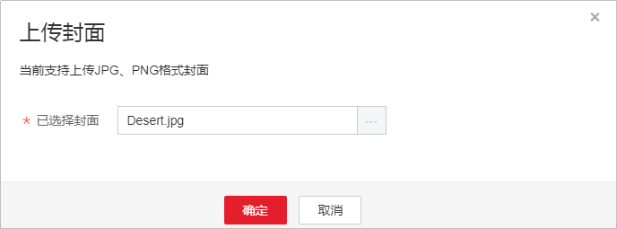

# 音视频管理

[音视频上传](控制台上传.md)后，您可以在“音视频管理”页面使用转码、分类、CDN预热、音频提取、信息一键导出等功能。音频文件和视频文件支持的管理功能是存在差异的，如[表1 管理能力表](#table186842715015)所示。

**表 1**  支持的管理功能

<table><thead align="left"><tr id="row1886918275503"><th class="cellrowborder" valign="top" width="34.27%" id="mcps1.2.4.1.1">
功能项

</th>
<th class="cellrowborder" valign="top" width="32.31%" id="mcps1.2.4.1.2">
视频文件（√表示支持，×表示不支持）

</th>
<th class="cellrowborder" valign="top" width="33.42%" id="mcps1.2.4.1.3">
音频文件（√表示支持，×表示不支持）

</th>
</tr>
</thead>
<tbody><tr id="row186952719508"><td class="cellrowborder" valign="top" width="34.27%" headers="mcps1.2.4.1.1 ">
转码

</td>
<td class="cellrowborder" valign="top" width="32.31%" headers="mcps1.2.4.1.2 ">
√

</td>
<td class="cellrowborder" valign="top" width="33.42%" headers="mcps1.2.4.1.3 ">
×

</td>
</tr>
<tr id="row18870142785014"><td class="cellrowborder" valign="top" width="34.27%" headers="mcps1.2.4.1.1 ">
预热

</td>
<td class="cellrowborder" valign="top" width="32.31%" headers="mcps1.2.4.1.2 ">
√

</td>
<td class="cellrowborder" valign="top" width="33.42%" headers="mcps1.2.4.1.3 ">
√

</td>
</tr>
<tr id="row1787062716502"><td class="cellrowborder" valign="top" width="34.27%" headers="mcps1.2.4.1.1 ">
设置分类

</td>
<td class="cellrowborder" valign="top" width="32.31%" headers="mcps1.2.4.1.2 ">
√

</td>
<td class="cellrowborder" valign="top" width="33.42%" headers="mcps1.2.4.1.3 ">
√

</td>
</tr>
<tr id="row5871162765019"><td class="cellrowborder" valign="top" width="34.27%" headers="mcps1.2.4.1.1 ">
提取音频

</td>
<td class="cellrowborder" valign="top" width="32.31%" headers="mcps1.2.4.1.2 ">
√

</td>
<td class="cellrowborder" valign="top" width="33.42%" headers="mcps1.2.4.1.3 ">
×

</td>
</tr>
<tr id="row198711627175019"><td class="cellrowborder" valign="top" width="34.27%" headers="mcps1.2.4.1.1 ">
导出

</td>
<td class="cellrowborder" valign="top" width="32.31%" headers="mcps1.2.4.1.2 ">
√

</td>
<td class="cellrowborder" valign="top" width="33.42%" headers="mcps1.2.4.1.3 ">
√

</td>
</tr>
<tr id="row1487217277506"><td class="cellrowborder" valign="top" width="34.27%" headers="mcps1.2.4.1.1 ">
删除

</td>
<td class="cellrowborder" valign="top" width="32.31%" headers="mcps1.2.4.1.2 ">
√

</td>
<td class="cellrowborder" valign="top" width="33.42%" headers="mcps1.2.4.1.3 ">
√

</td>
</tr>
<tr id="row6829121243417"><td class="cellrowborder" valign="top" width="34.27%" headers="mcps1.2.4.1.1 ">
取消转码

</td>
<td class="cellrowborder" valign="top" width="32.31%" headers="mcps1.2.4.1.2 ">
√

</td>
<td class="cellrowborder" valign="top" width="33.42%" headers="mcps1.2.4.1.3 ">
√

</td>
</tr>
<tr id="row759674513559"><td class="cellrowborder" valign="top" width="34.27%" headers="mcps1.2.4.1.1 ">
上传封面

</td>
<td class="cellrowborder" valign="top" width="32.31%" headers="mcps1.2.4.1.2 ">
√

</td>
<td class="cellrowborder" valign="top" width="33.42%" headers="mcps1.2.4.1.3 ">
√

</td>
</tr>
<tr id="row1939333865915"><td class="cellrowborder" valign="top" width="34.27%" headers="mcps1.2.4.1.1 ">
添加字幕

</td>
<td class="cellrowborder" valign="top" width="32.31%" headers="mcps1.2.4.1.2 ">
√

</td>
<td class="cellrowborder" valign="top" width="33.42%" headers="mcps1.2.4.1.3 ">
×

</td>
</tr>
</tbody>
</table>

## 查看媒资信息

-   **基本信息**

    您可以单击音视频所在行右侧“管理 \> 基本信息”，查看媒资名称，媒资ID，封面，字幕，时长，创建时间，大小，最近更新时间，类别，标签以及描述。若您的媒资属于OBS托管过来的，基本信息中还会有源路径和输出位置字段信息。

-   **播放地址**

    您可以单击视频所在行右侧“管理 \> 播放地址”，查看原始文件以及转码后文件的清晰度，格式，视频编码格式，分辨率，码率，大小以及播放地址。

-   **字幕与封面信息**

    单击视频所在行右侧“管理 \> 字幕与封面信息”，若您为上传的文件添加了字幕以及封面，则在此页面可以查看到封面以及字幕的格式，播放地址。

-   **代码示例**

    单击视频所在行右侧“管理 \> 代码示例”，您可以参考示例代码快速将音视频集成到您的网站页面中。

## 修改基本信息

您可以在基本信息页修改音视频文件的分类、标签、名称、描述信息。

1.  单击音视频所在行的“管理”，在“基本信息”页签单击“编辑”，进入基本信息编辑状态。
2.  单击“设置分类”，可以重新设置媒资所属的分类。
3.  在“标签”、“名称”和“描述信息”输入框内输入您需要设置的信息，方便您通过高级搜索功能查找媒资文件。
4.  单击“保存”，再单击“关闭”，关闭详情界面，则可以在视频管理界面看到更新的描述以及分类。

## 更新封面

音视频文件上传后，系统会默认生成封面，您也可以从本地上传JPG或PNG格式的图片作为其封面。若需要使用视频中某个画面作为封面，您可以使用[视频截图](视频截图.md)功能。

1.  单击音视频所在行的“管理”，在“基本信息”页签单击“编辑”，封面处于编辑状态。

    **图 1**  媒资基本信息  
    

2.  单击“封面”后的加号框，在“上传封面”弹框内，选择本地图片文件。

    **图 2**  上传封面  
    

3.  单击“保存”后，关闭编辑状态。

    封面将在3到5分钟之内生效。

## 添加字幕

您可以为视频文件添加格式为“SRT“，文字编码为“UTF-8“的字幕文件。字幕文件上传成功后，需要对视频进行转码才能在视频中压制对应字幕。

1.  单击音视频所在行的“管理”，在“基本信息”页签单击“编辑”，进入基本信息编辑状态。
2.  单击“上传字幕”，选择本地字幕文件上传。
3.  单击“保存”后，关闭编辑状态。
4.  勾选视频，单击“转码”，重新转码压制字幕。
5.  单击音视频所在行的“管理”，即可在“字幕与封面信息”页签获取到字幕文件URL。

## 转码

您可以在“音视频管理”页面选择一个或多个音视频文件进行转码。

-   支持输入的音视频文件格式：MP4、TS、MOV、FLV、MPG、MXF、WMV、ADTS、AVI、MKV、MPEG等。
-   支持输入的视频编码格式：H.264、 H.265、 MPEG-2、MPEG-4、MJPEG、WMV1/2/3、Proress422等
-   支持输入的音频编码格式：AAC、 AC3、EAC3、HE-AAC、MP2、MP3、PCM（s161e，s16be,，s241e，s24be，dvd）、WMA等

1.  勾选一个或者多个音视频文件，单击“转码”。
2.  在弹框内选择系统预置模板或在[转码设置](转码设置.md)的配置的自定义模板，单击“确认”。
3.  在音视频管理界面可以看到音视频文件的转码状态为“转码中“。
4.  转码完成后，您可以单击音视频所在行的“管理”，在“播放地址”页签获取转码后的播放地址。

## 预热

预热是指CDN节点主动回源拉取最新的音视频文件，当用户初次请求时，将由CDN节点提供内容分发，加快用户下载缓存时间，提高用户体验。

1.  勾选一个或者多个音视频文件。
2.  单击“预热“，即可将媒资文件下发到CDN节点。

## 分类

勾选单个或者多个音视频文件，单击““设置分类“”，即可将选择的音视频文件进行分类。

## 音频提取

若只需要某个视频文件的音频内容，您可以使用该功能将视频文件中的音频提取出来，暂只支持提取出MP3格式的音频文件。

1.  勾选一个或多个视频文件，单击“音频提取”。
2.  刷新音视频管理界面，可以看到提取音频任务的处理状态为“转码中”。
3.  转码成功后，可在音频所在行的右侧“管理 ”，在“播放地址”页签查看音频文件的播放URL。

    提取出来的音频文件与原视频文件同名称，您可以根据描述来找到对应的音频文件，音视频列表默认不呈现“描述”列，请在页面右侧单击，勾选“描述”。

## 导出

勾选单个或者多个音视频文件，单击“导出”，即可导出选中的音视频文件信息。若不勾选，则默认导出所有音视频文件信息。音视频文件信息包括媒资ID、媒资名称、媒资状态、标签、分类、清晰度以及媒资播放URL、封面、字幕URL等多项详细信息。

## 音视频搜索

当音视频管理界面文件较多时，您可以使用搜索功能进行音视频查找。

-   简易搜索：在右上方的搜索框输入名称、描述或者分类名称进行查找。

-   高级搜索：单击“高级搜索”下拉框，检索条件如下所示。

    **图 3**  高级搜索  
    

    -   高级搜索可多维度筛选，但当通过媒资ID搜索时，其他筛选过滤条件失效。
    -   已删除的媒资通过关键字，便签等搜索不会展示，只有通过媒资ID搜索时才能展示。
    -   媒资状态包含已发布、未发布；转码状态包括转码中、未转码、转码成功、转码失败。
    -   媒资ID是识别上传成功视频片源的唯一ID，只要视频上传成功，无论转码是否成功都会有媒资ID。
    -   分类ID用于识别不同的分类名称，您可在“全局设置 \> 分类设置”界面查询。

## 播放

该功能会产生下行流量费用，具体价格详情请参见[价格详情](https://www.huaweicloud.com/pricing.html?tab=detail#/vod)。

-   **控制台预览**

    支持预览MP4、FLV、HLS以及DASH格式的视频文件，未转码视频不能保证Console播放预览，建议您转码后再播放。

    -   单击音视频文件封面，优先预览播放转码后的音视频文件。
    -   单击视频右侧“管理 \> 播放地址”，单击"“操作”列，也可预览播放。

        **图 4**  预览播放  
        

-   **播放器播放**

    单击视频右侧“管理”，选择“播放地址”页签，在“操作”列单击复制播放URL，可以使用华为云提供的[Web播放器Demo](https://media-cache.huaweicloud.com/video/hwplayer/0.0.6/example/index.html)或[视频云APP](https://support.huaweicloud.com/demo-vod/vod_09_0001.html)播放。

    若您对音视频文件进行了重新转码，对应的转码播放地址可能会存在变化，具体如下所示：

    -   重新转码时，若转码参数不变，则播放URL不变。
    -   重新转码时，若修改转码参数，则不同的输出格式有如下区别：
        -   若输出格式为MP4，则旧URL不能播放。
        -   若输出格式为HLS，总索引对应的URL不变；二级索引的URL会变， 旧URL不能再播放。
        -   若输出格式为DASH，总索引对应的URL不变；二级索引的URL会变， 旧URL不能再播放。

## 删除

您可以在音视频列表中，选择某个或者多个媒资，单击“删除”。确认删除后，该文件的所有相关资源，包括原始文件、转码文件、截图文件等都将被彻底删除，且操作无法撤销，请谨慎使用。

